# Procesverslag
Markdown is een simpele manier om HTML te schrijven.  
Markdown cheat cheet: [Hulp bij het schrijven van Markdown](https://github.com/adam-p/markdown-here/wiki/Markdown-Cheatsheet).

Nb. De standaardstructuur en de spartaanse opmaak van de README.md zijn helemaal prima. Het gaat om de inhoud van je procesverslag. Besteedt de tijd voor pracht en praal aan je website.

Nb. Door *open* toe te voegen aan een *details* element kun je deze standaard open zetten. Fijn om dat steeds voor de relevante stuk(ken) te doen.

## Jij

  
uitwerken voor kick-off werkgroep

  ### Auteur:
  Saraï Benjamins

  #### Je startniveau:
  Blauw

  #### Je focus:
  Responsive
 

## Je website

  
uitwerken voor kick-off werkgroep

  ### Je opdracht:
  https://straatmuseum.com/nl/

  #### Screenshot(s) van de eerste pagina (small screen): 
  hier de naam van de pagina  
  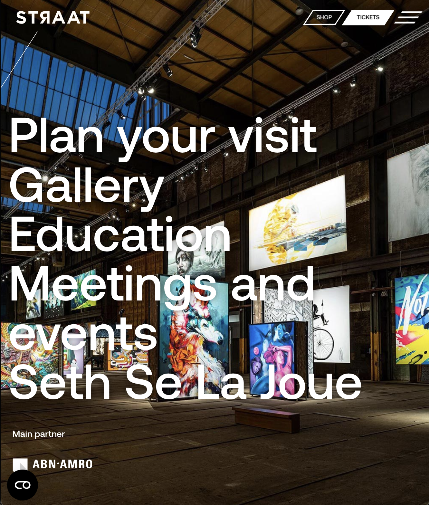

  #### Screenshot(s) van de tweede pagina (small screen):
  hier de naam van de pagina  
  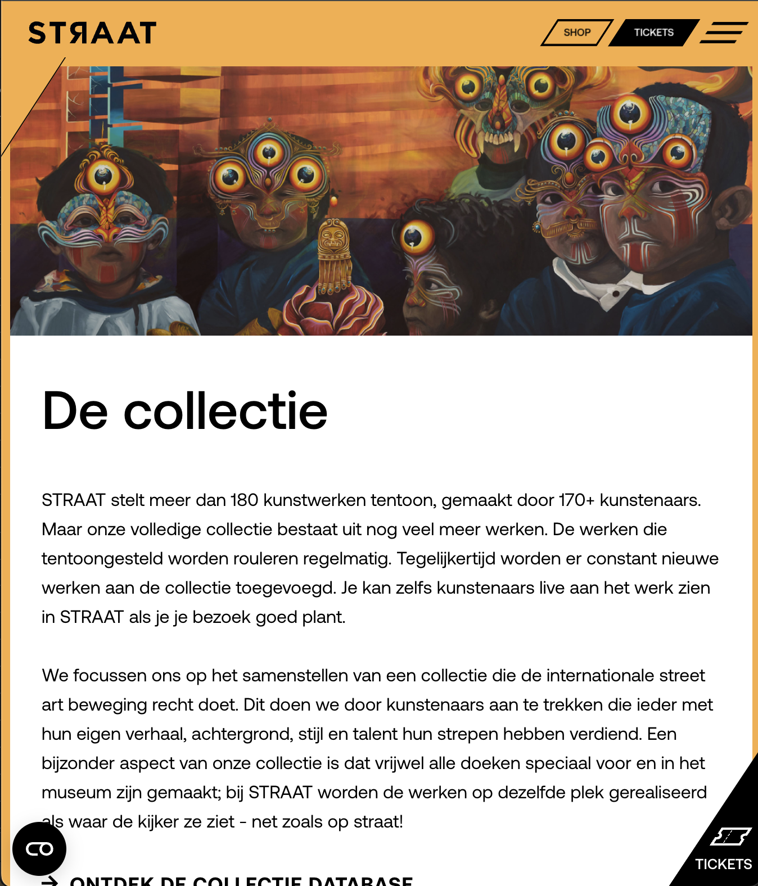
 

## Toegankelijkheidstest 1/2 (week 1)

  
uitwerken na test in 2e werkgroep

  ### Bevindingen
  Lijst met je bevindingen die in de test naar voren kwamen:
  - Structuur is logisch en alle kopjes worden op volgorde voorgelezen
  - De afbeeldingen hebben geen alt teksten
  - Ze hebben geen light/dark mode
  - Ik vind dat de header smoother in beeld kan komen als je naar beneden scrollt
  - Op klein scherm gaat de header tekst niet schuin staan als je erover heen hovert, op groot scherm wel

## Breakdownschets (week 1)

  
uitwerken na afloop 3e werkgroep

  ### de hele pagina: 
  

  ### dynamisch deel (bijv menu): 
  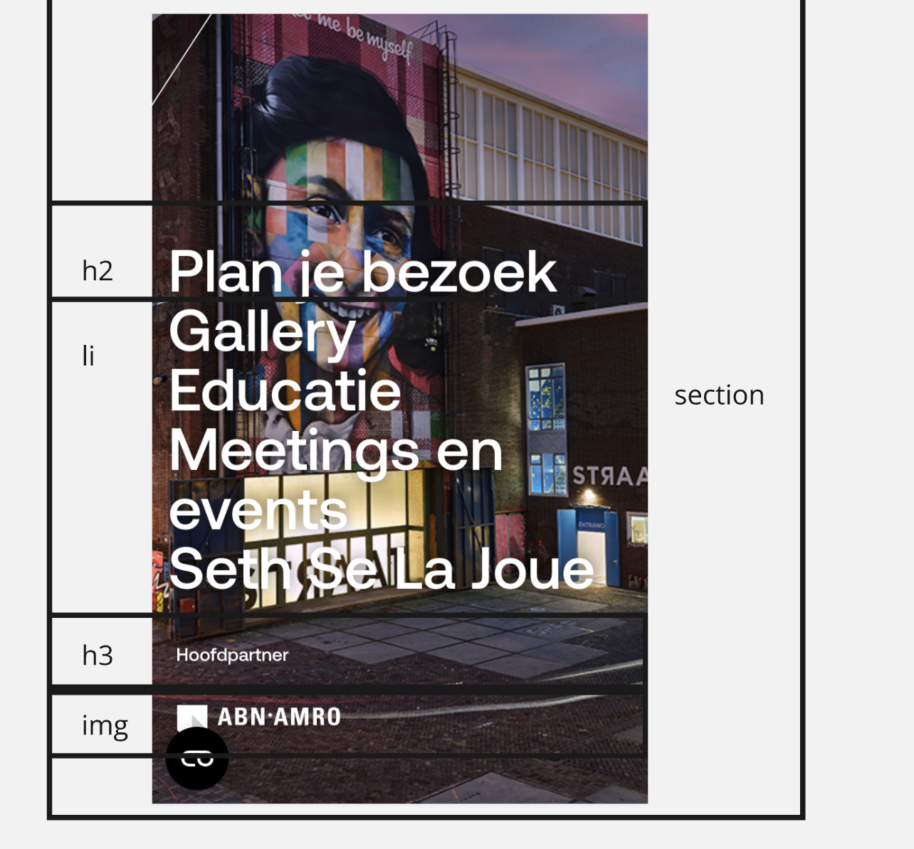

  ### wellicht nog een dynamisch deel (bijv filter): 
  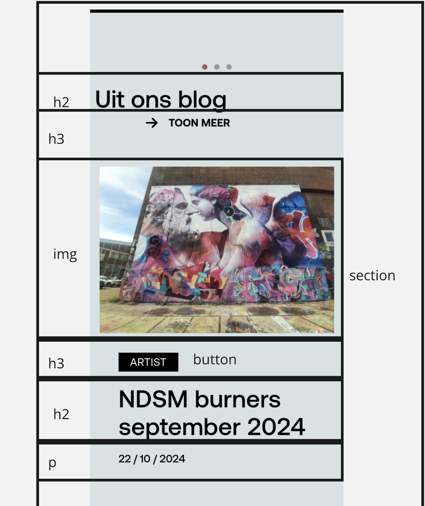

## Voortgang 1 (week 2)

  
uitwerken voor 1e voortgang

  ### Stand van zaken
  Ik was helaas ziek bij dit gesprek

  ### Agenda voor meeting
  samen met je groepje opstellen

  | student 1      | student 2          | student 3    | student 4        |
  | ---            | ---                | ---          | ---              |
  | dit bespreken  | en dit             | en ik dit    | en dan ik dat    |
  | en dat ook nog | dit als er tijd is | nog een punt | dit wil ik zeker |
  | ...            | ...                | ...          | ...              |

  ### Verslag van meeting
  hier na afloop snel de uitkomsten van de meeting vastleggen

  - punt 1
  - punt 2
  - nog een punt
  - ...

## Voortgang 1 (week 3)

  
uitwerken voor 2e voortgang

  ### Stand van zaken
  Deze week ging het niet goed, omdat ik verkeerde elementen heb gebruikt omdat ik dacht dat er geen padding etc gebruikt mocht worden. Dat heb ik die week gelijk weggehaald en aangepast

  ### Agenda voor meeting
  samen met je groepje opstellen

  | student 1      | student 2          | student 3    | student 4        |
  | ---            | ---                | ---          | ---              |
  | dit bespreken  | en dit             | en ik dit    | en dan ik dat    |
  | en dat ook nog | dit als er tijd is | nog een punt | dit wil ik zeker |
  | ...            | ...                | ...          | ...              |

  ### Verslag van meeting
  hier na afloop snel de uitkomsten van de meeting vastleggen

  - Wel padding gebruiken
  - Geen Transform/Translate
  - Minder code is soms beter

## Toegankelijkheidstest 2/2 (week 4)

  
uitwerken na test in 9e werkgroep

  ### Bevindingen
  Lijst met je bevindingen die in de test naar voren kwamen (geef ook aan wat er verbeterd is):

  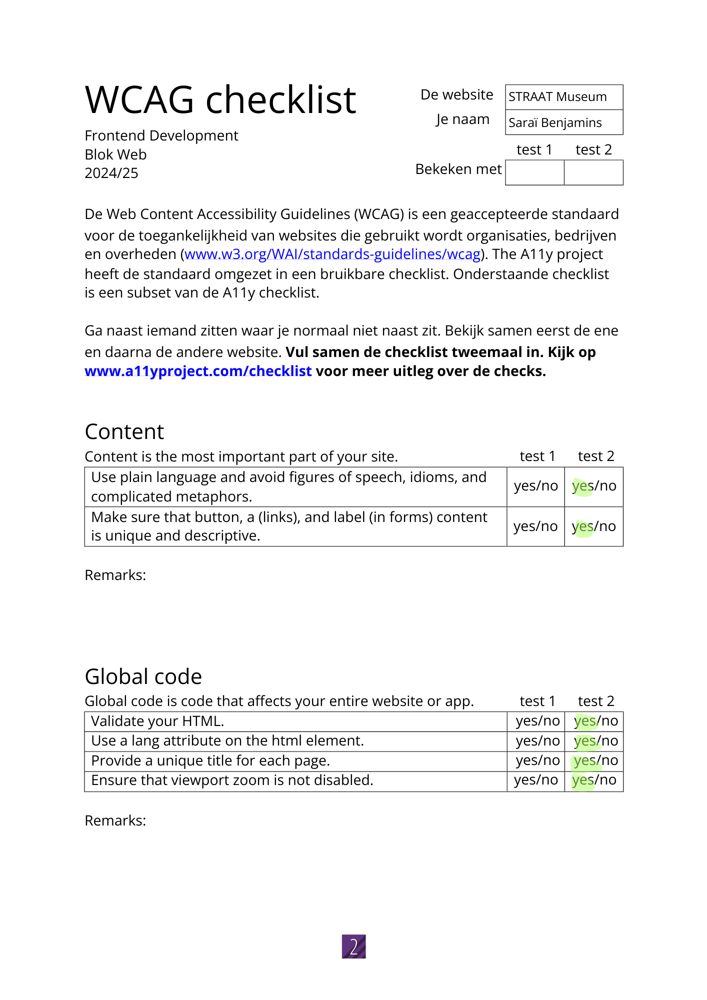
  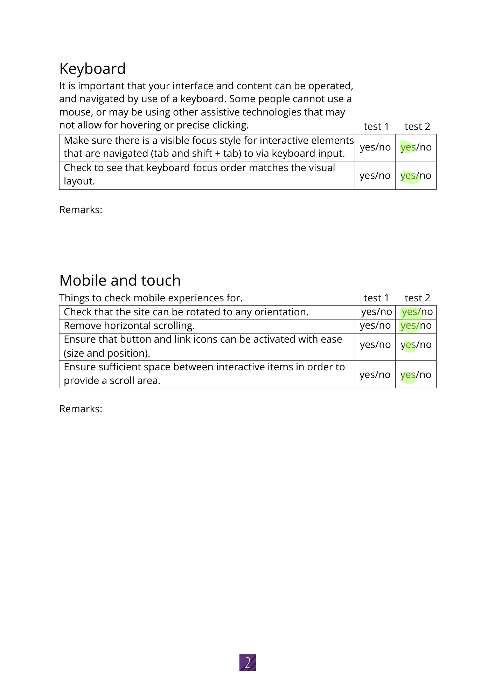
  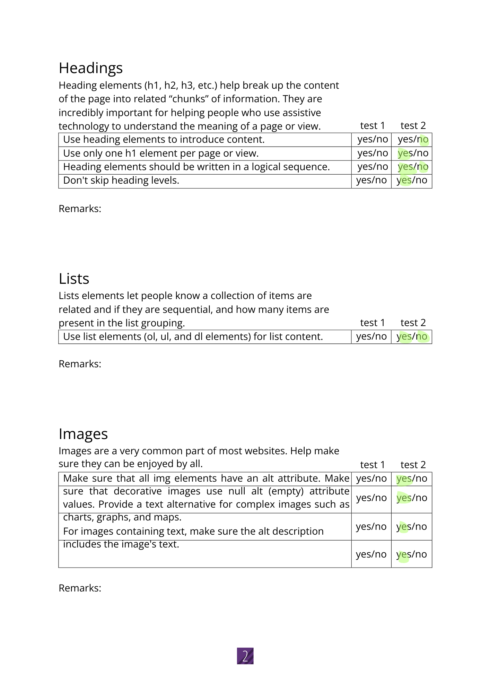
  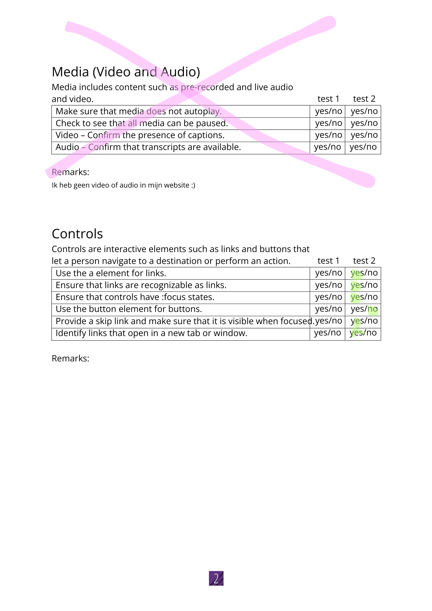
  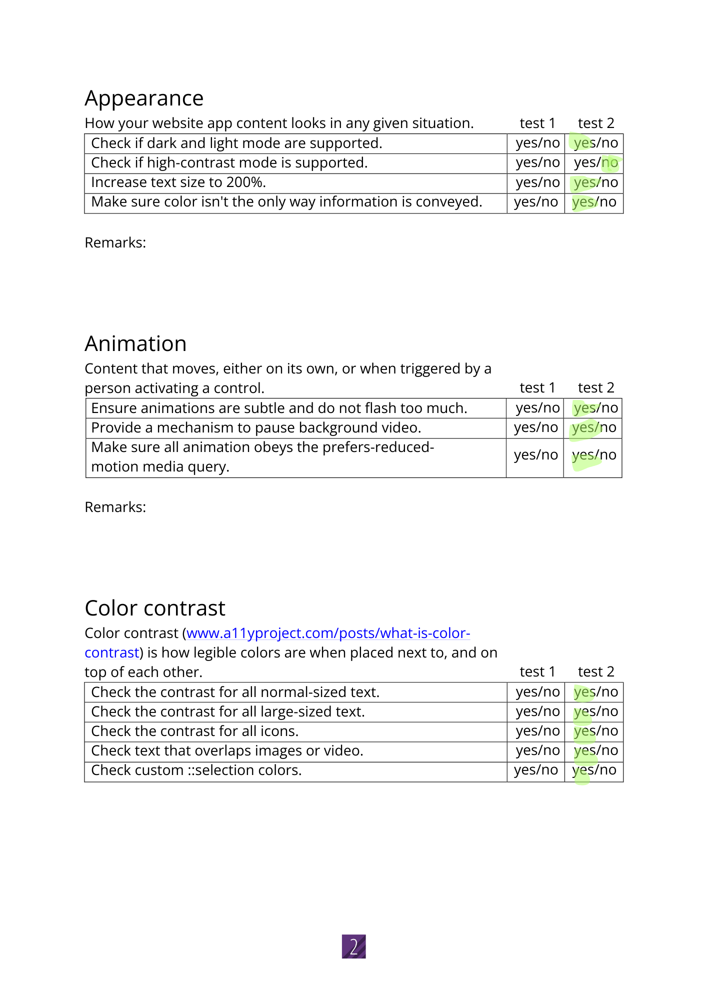

Goede punten van mijn website:

- Dark/light werkt goed
- Mijn website is responsive, waardoor hij er goed uitziet op verschillende schermformaten, zoals mobiel, tablet en desktop.
- Alle afbeeldingen op mijn website hebben goede alt-teksten
- De HTML structuur klopt meer op de 2e pagina
- Je kan wel goed op volgorde navigeren door mijn website alleen komen niet alle elementen met elkaar overeen met wat er staat, zoals h2's wat linkjes moeten zijn. 

Minder goede punten van mijn website:

- De HTML-structuur klopt niet bij de 1e pagina
- Ik heb op sommige plekken H2-elementen gebruikt waar eigenlijk links beter op hun plaats waren.
- Niet alle knoppen op mijn website zijn met het <button>-element gemaakt
- Mijn website werkt niet goed samen met hoog-contrastinstellingen
- Ik had bij bepaalde button elementen zelf de button kunnen maken/stylen via css
  

## Voortgang 2 (week 4)

  
uitwerken voor 3e voortgang

  ### Stand van zaken
  De website zag er al aardig hetzelfde uit als de 'echte', de code zag er prima uit zei de leerling hulp. Ik heb nog tips gekregen met bepaalde dingen waar ik vast mee liep. Zoals hoe ik een form kon toevoegen of hoe ik linear gradient kon toevoegen.

  ### Agenda voor meeting
  samen met je groepje opstellen

  | student 1      | student 2          | student 3    | student 4        |
  | ---            | ---                | ---          | ---              |
  | dit bespreken  | en dit             | en ik dit    | en dan ik dat    |
  | en dat ook nog | dit als er tijd is | nog een punt | dit wil ik zeker |
  | ...            | ...                | ...          | ...              |

  ### Verslag van meeting
  hier na afloop snel de uitkomsten van de meeting vastleggen

  - Tips gekregen hoe ik bepaalde dingen kon oppakken

## Voortgang 3 (week 4)

  
uitwerken voor 3e voortgang

  ### Stand van zaken
  Dit gesprek heb ik vooral gebruikt om veel tips te vragen aan Sanne. Bijvoorbeeld voor de slider. Voorderest hadden we mijn code niet gecheckt

## Herkansing (week 5)

  
uitwerken voor eindgesprek

  ### Je uitkomst - karakteristiek screenshots:
  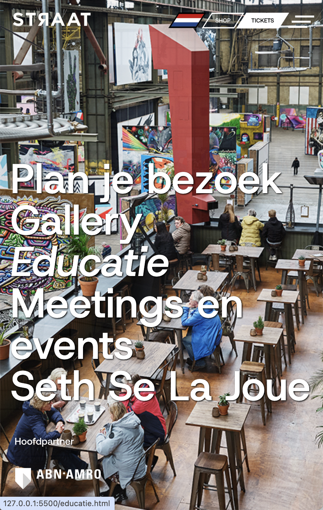
    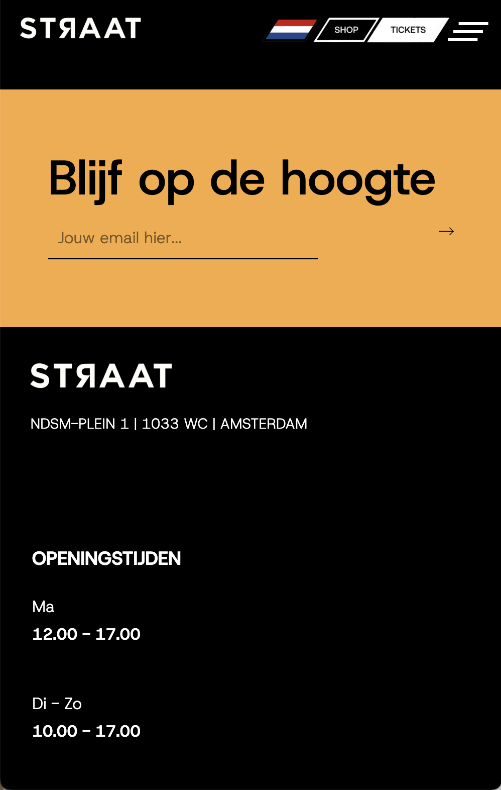
      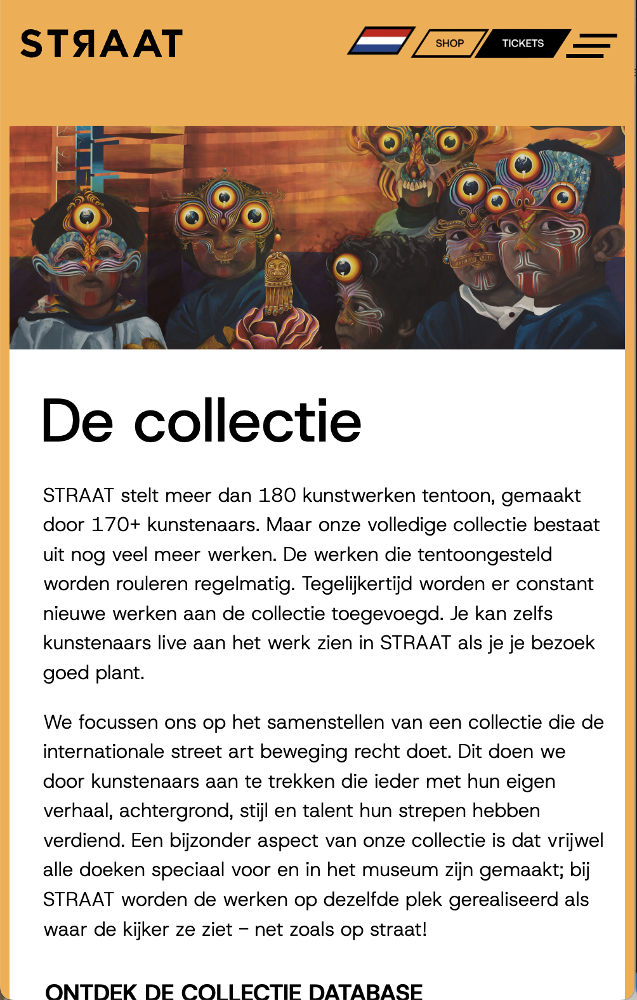
        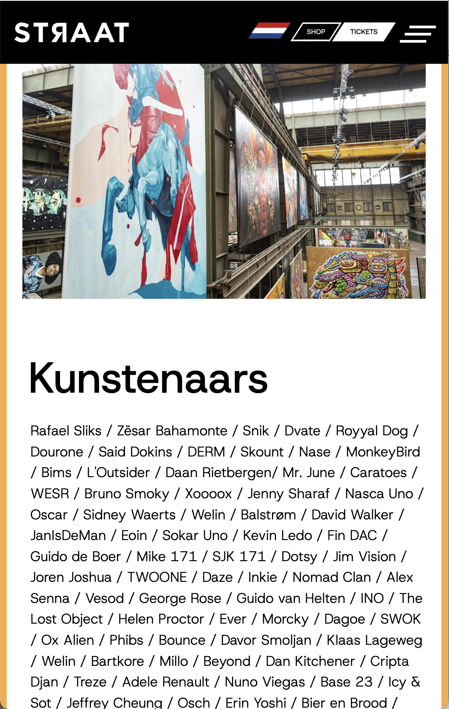

  ### Dit ging goed/Heb ik geleerd: 
  Wat goed ging was de header in orde maken en de footer. Ik heb eigenlijk heel veel geleerd en heb veel geprobeerd om dingen uit te testen. Ik vind dit namelijk heel moeilijk en ligt niet helemaal in mijn straatje. 

  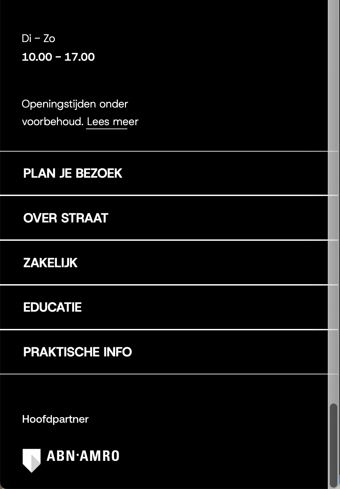

  ### Dit was lastig/Is niet gelukt:
  Wat ik lastig vond was de slider maken op de hoofdpagina, hij is uiteindelijk wel redelijk gelukt. Wat mij niet gelukt is, is om nog een microinteractie van de talen te fixen in de header. Op de echte site kan je tussen talen switchen en dat wilde ik ook graag laten lukken. 

  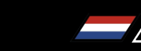
  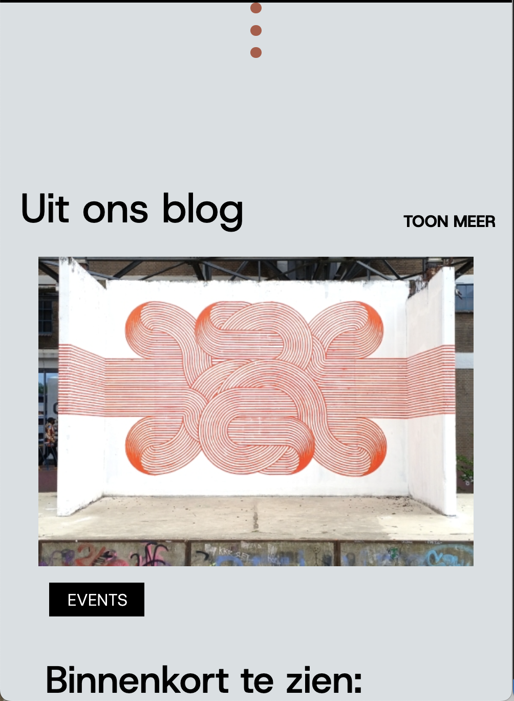

## Bronnenlijst

  
continu bijhouden terwijl je werkt

  Nb. Wees specifiek ('css-tricks' als bron is bijv. niet specifiek genoeg). 
  Nb. ChatGpT en andere AI horen er ook bij.
  Nb. Vermeld de bronnen ook in je code.

  1. /* Bron Light/Dark mode: https://developer.mozilla.org/en-US/docs/Web/CSS/@media/prefers-color-scheme*/
  2. /* Bron Visually Hidden: https://www.a11yproject.com/posts/how-to-hide-content/ */
  3. /*https://developer.mozilla.org/en-US/docs/Web/CSS/@keyframes */
  4. /* Bron hamburgermenu: https://codepen.io/shooft/pen/JjQLVeB */
  5. /* https://www.w3schools.com/howto/howto_js_mobile_navbar.asp */
  6. /* Bron marquee: https://developer.mozilla.org/en-US/docs/Web/HTML/Element/marquee */
  7. /* Bron Swipe menu: https://codepen.io/shooft/pen/vEBXLWb */
  8. /* Bron linear gradient: https://developer.mozilla.org/en-US/docs/Web/CSS/gradient/linear-gradient */
  9. /* Bron form email: https://developer.mozilla.org/en-US/docs/Web/HTML/Element/input/email */
  10. /* Bron details summary: https://developer.mozilla.org/en-US/docs/Web/HTML/Element/details */
  11. /* Bron Visually Hidden: https://www.a11yproject.com/posts/how-to-hide-content/ */
  12. /* Bron keyframes slide in menu: https://developer.mozilla.org/en-US/docs/Web/CSS/@keyframes*/
  13. /* Bron styling nav: https://www.w3schools.com/howto/howto_js_mobile_navbar.asp*/
  14. /* Bron Details summary: https://statics.teams.cdn.office.net/evergreen-assets/safelinks/1/atp-safelinks.html*/
  15. /* Bron Zwarte SVG logo naar wit: https://developer.mozilla.org/en-US/docs/Web/CSS/filter-function/brightness */
  16. /* Bron Chat GPT: gebruikt om de afbeeldingen naast elkaar te hebben staan bij groter scherm voor de 4 afbeeldingen op de collectie pagina */
  17. /* Bron responsive maken van pagina's: /* Bron Chat GPT: gebruikt om de afbeeldingen naast elkaar te hebben staan bij groter scherm voor de 4 afbeeldingen op de collectie pagina */ 
  18. /* Bron Chat GPT stijlen van de details summary*/
  19. /* Bron Chat GPT: om hulp te krijgen hoe ik de afbeeldingen wit maak als de zwarte balk naar beneden komt, gebruikt voor het hamburger menu en het wisselen van img */
  20. /* Bron Chat GPT gebruikt voor uitleg keyframes met afbeeldingen (main) */
  21. /* Bron Chat GPT: gebruikt voor het stijlen van de form en input van de form */

